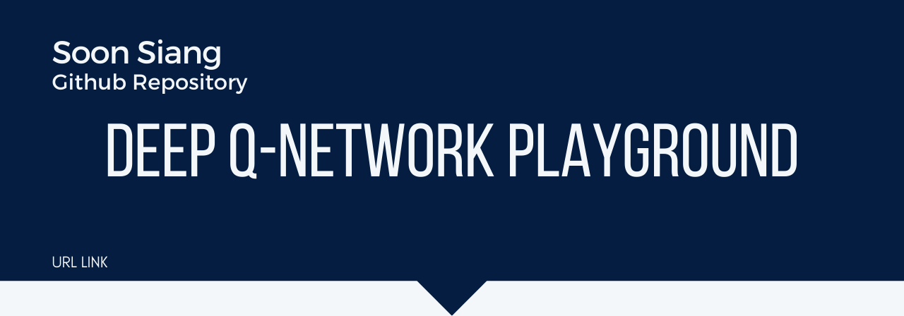
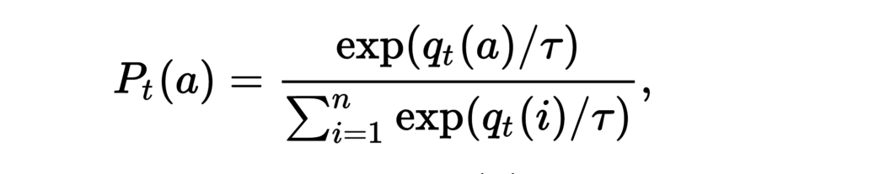
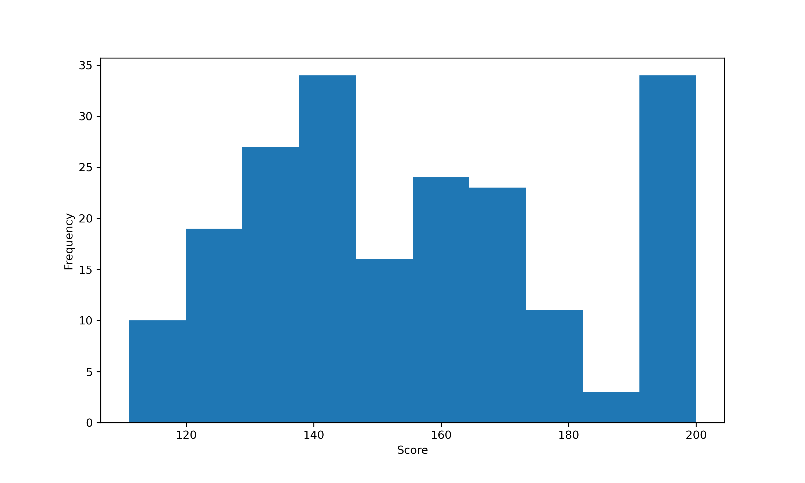

# Analysis of DQN Policy

[](https://www.python.org/)
[](http://commonmark.org)
[](https://shields.io/)

Author: Soon Siang <br>
Date: 3 April 2021



# Objective

This notebook will analyze how different mechanisms of choosing an action will result in differences in the distribution of scores attained by the agent playing cartpole, a game where the agent objective's is to balance an inverted pendulum on a cart.

Three simple policies are analyzed:

1) Epsilon-greedy policy.<br>
2) Epsilon-greedy policy with Boltzmann action.<br>
3) Boltzmann action.<br>

## Epsilon-greedy policy


<center><b>Epsilon-greedy</b></center>
Source: https://www.geeksforgeeks.org/epsilon-greedy-algorithm-in-reinforcement-learning/

As above, epsilon-greedy policy implies that when the agent is deciding which action to take, with probability epsilon, it will take the Q-value maximizing action, and with probability 1-epsilon, it will take a random action from the action space. The codes below show the implementation of such policy:

```python
    def eps_greedy(self, state):

        rnd = random.random()
        if rnd < self.epsilon:
            return random.randint(0, self.action_size - 1)
        return self.get_greedy_action(state)
    
    def get_greedy_action(self, state):

        Q_values = self.net.model.predict(state)[0]
        greedy_action = np.argmax(Q_values)
        
        return greedy_action
```


## Epsilon-greedy policy with Boltzmann action

Similar to epsilon-greedy policy except that with 1-epsilon probability, the agent will choose action in the action space based on the Boltzmann distribution (termed as `Boltzmann action`), given below:


<center><b>Boltzmann's Softmax</b></center>
Source: https://medium.com/emergent-future/simple-reinforcement-learning-with-tensorflow-part-7-action-selection-strategies-for-exploration-d3a97b7cceaf

The implementation is as follows:

```python
    def eps_greedy_boltzmann(self, state):

        rnd = random.random()
        if rnd < self.epsilon:
            return self.boltzmann_action_with_temperature(state)
        return self.get_greedy_action(state)
    
    def boltzmann_action_with_temperature(self, state):

        Q_values = self.net.model.predict(state)[0] / self.epsilon
        log_probs = Q_values - logsumexp(Q_values)
        [action] = np.random.choice(self.action_size, size = 1, p = np.exp(log_probs))
        
        return action
```
    
## Boltzmann action

Lastly, the policy that the agent will take is only the `Boltzmann action`, given in the above equation and with its implementation shown above as the function `boltzmann_action_with_temperature()`.

## Basis for Comparison

These three policies, in a sense, be placed on a continuum between putting different weights from more reliance on the model given by DQN (Boltzmann action) to more freedom for the agent to choose an action base on a uniform prior (i.e. no additional information given to the model when it is free to choose any action from the action space in the epsilon-greedy policy).

*****

# Methodology

The agent is trained for 200 episodes, using the 'Cartpole' environment provided by [OpenAI Gym](https://gym.openai.com/).

The basis of comparison for the effectiveness of different policies is the distribution of the scores attained by the trained-agent for 200 episodes of playing the game. When playing the game, i.e. balancing the cartpole, the agent always choose the greedy action given by the model.<br>

The maximum score that an agent is capable of attaining before the episode is terminated artificially is 199.<br>

Therefore, one can roughly quantify the agent's effectiveness at playing the cartpole game by looking at the percentage of games in which the agent attains the maximum score of 199.<br>

## Related Files

The files relating to this experiment-playground are:

1) main.py: containing train() and play() functions to allow the agent to train and play in the environment respectively. <br>
2) agent.py: the implementation of the Agent class.<br>
3) model.py: the implementation of the Model class.<br>
4) memory.py: the implementation of the ExperienceReplay class.<br>

The implementation of the ExperienceReply class is taken from [here](https://towardsdatascience.com/deep-q-network-dqn-ii-b6bf911b6b2c).

The implementation of the get_training_data() method within the Agent class is taken from [here](https://github.com/cwchong/coursework/blob/main/210330_pract9/cartpoleDQN-start/agent.py).

## Model

The model is a simple neural network with a dropout layer as given below:

```python
    self.model = Sequential([
        Dense(24, activation='relu', input_shape=(state_size, )),
        Dropout(0.2),
        Dense(24, activation='relu'),
        Dense(action_size, activation='linear')
    ])
```
*****

# Results

## Epsilon-greedy policy


<center><b>Epilson-greedy</b></center>

As seen from the histogram above, the agent trained with such policy is able to attain the maximum score around 100% of the time.

## Epilson-greedy with Boltzmann action


<center><b>Epilson-greedy with Boltzmann action</b></center>

As seen from the histogram above, the agent trained with such policy is able to attain the maximum score around 70% of the time.

## Boltzmann action

<center><b>Boltzmann action</b></center>

As seen from the histogram above, the agent trained with such policy is able to attain the maximum score around 17.5% of the time.

# Discussion

|                                        	| Epsilon-greedy 	| Epsilon-greedy with Boltzmann action 	| Pure Boltzmann action 	|
|:--------------------------------------:	|:--------------:	|:------------------------------------:	|:---------------------:	|
| Percentage of maximum attainable score 	|      100%      	|                  70%                 	|         17.5%         	|

It is clear that epsilon-greedy policy beats the other variants.

## Bias in exploration; the spirit of exploration

The reason for the worse-performance of the other two variants of policy may be due to a bias in exploration. These policies place a bias by favoring the action believed by the neural network to be Q values maximizing. Consequently, exploration of the state space is more limited than exploring with a uniform prior on the actions space. This can also be said to be going against the spirit of pure exploration.

# Conclusion

By conducting this simple experiment, it highlights the importance of exploitation-versus-exploration trade-off and how when choosing to explore, the agent ought to be exploring with a uniform prior over the action space. Doing this will lead a greater region of the Q-space being included into the Experience Replay buffer such that the model will better approximate the actual Q-landscape.
