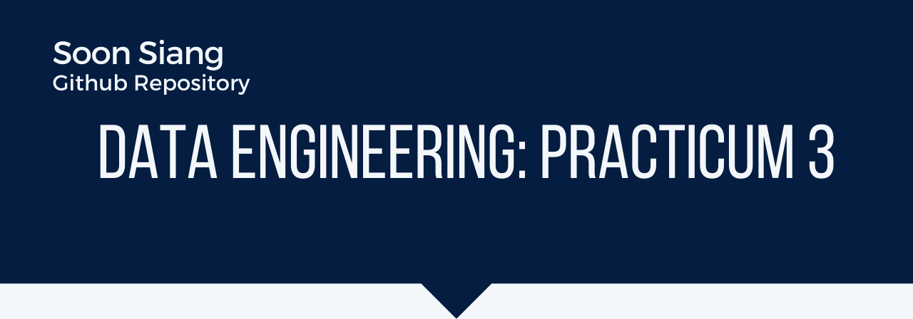

# Data Engineering Practicum on Stream Processing


Author: Soon Siang

Date: 21 April 2021



## Introduction and Objectives

The objectives of this practicum are as follow:

1. To use Kakfa to live-process the tweets retrieved using the Twitter's API.
2. To use a NLP model to predict the category on which the individual tweet falls under. The possible categories to which each tweet is classified under are: `['soc.religion.christian', 'sci.space', 'sci.electronics', 'talk.religion.misc', 'rec.motorcycles']`.

## RNN Model

The RNN model's summary is as follows:

```raw
Model: "sequential"
_________________________________________________________________
Layer (type)                 Output Shape              Param #   
=================================================================
embedding (Embedding)        (None, None, 256)         8722944   
_________________________________________________________________
gru (GRU)                    (None, 256)               394752    
_________________________________________________________________
dense (Dense)                (None, 5)                 1285      
=================================================================
Total params: 9,118,981
Trainable params: 9,118,981
Non-trainable params: 0
_________________________________________________________________
```

It is stored in `rnn_model_weights.h5` and it loaded to the Kakfa Consumer in production.

It was trained on the [20 Newsgroup dataset](https://scikit-learn.org/0.19/datasets/twenty_newsgroups.html) on 5 categories which are: `['soc.religion.christian', 'sci.space', 'sci.electronics', 'talk.religion.misc', 'rec.motorcycles']`.

It has achieved a test accuracy of around 80%.

More information are found in the Jupyter notebook: `Model_Training_for_NLP.ipynb`.

## Prediction of Category for the Tweets

Once one starts their Zookeeper server and both the Kakfa Producer and Consumer, the program will automatically stream the tweets from Twitter on a preset topic and classify these tweets to their individual categories.

